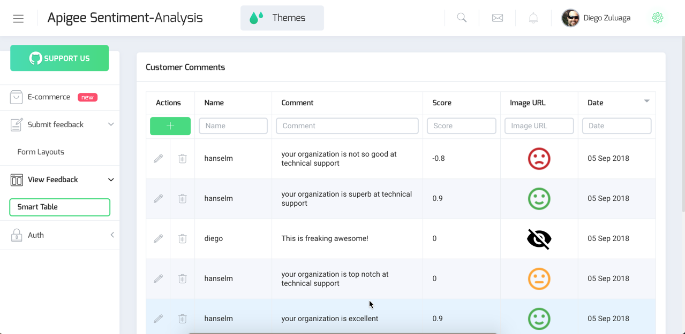

Apigee Sentiment Analysis App
=============================

Apigee sentiment Analysis App (ASAP) uses REST APIs built on top of Apigee. The purpose of this app is to show how to leverage a REST API into an App to build the user experience from two different roles: end-user/customer and customer service administrator.

[http://apigee-sales-bootcamp-demo.appspot.com/](http://apigee-sales-bootcamp-demo.appspot.com/)



### Getting started
Start by cloning this repo:
```bash
git clone https://github.com/dzuluaga/apigee-customer-sentiment-analysis-app.git
```

Install dependencies and start the app:
```bash
npm install
npm serve
```

### How it works
Describe the app:
* See Sentiment Analysis REST API
* include OpenAPI Spec and endpoints and how they map to the two pages: submit a comment (POST /comments) and retrieve comments (GET /comments).
* See [src/app/@core/data/smart-table.service.ts] to overide API_URL(src/app/@core/data/smart-table.service.ts)
* getData function
* Review [/src/app/pages/tables/smart-table/smart-table.component.ts](/src/app/pages/tables/smart-table/smart-table.component.ts) check constructor.
* Generate dist `$ ng build`
* Copy distributable files to public folder:
```bash
$ cp -rf ./dist/** ../ngx-admin-nodejs/public
```
* Push to gcloud with:
```bash
$ cd cd ../nodejs-server-app
$ gcloud app deploy --quiet
```

### References and Documentation

ASAP is implemented on [ngx-admin](https://github.com/akveo/ngx-admin), which is based on Angular 6+, Bootstrap 4 and Nebula. Here you can find [documentation](https://akveo.github.io/nebular/docs/guides/install-based-on-starter-kit). 

### License
[Apache 2](./LICENSE).

### How to contribute
* Star this repo.
* Report issues.